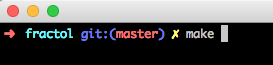
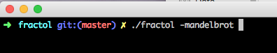
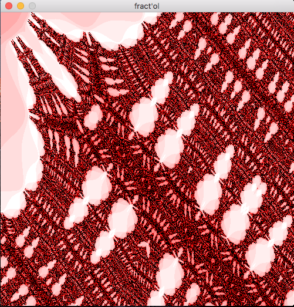
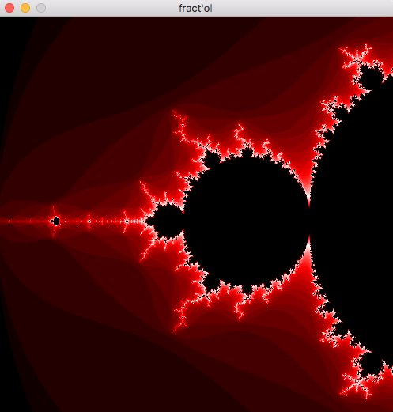
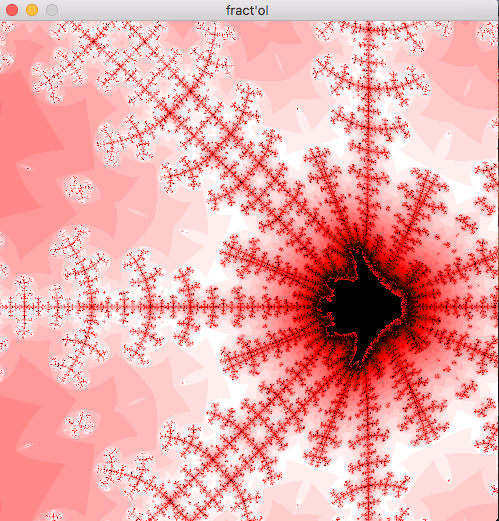
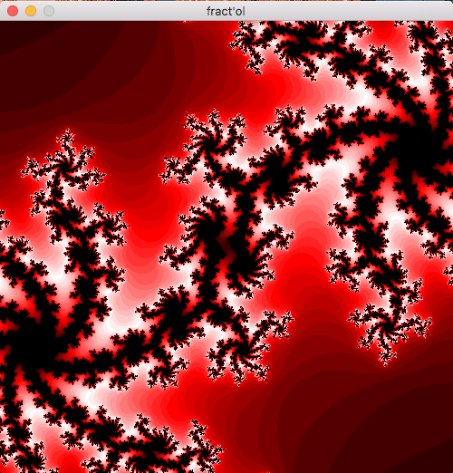

# fractol

## A fractal generator in C using mlx

first of all compile the project:

then launch with the fractal you want to see :
(-mandelbrot, -julia, -burningship, -meduse)

some examples :

